# BAM COP

*description of the project*

**Timeframe** 2026-08-28 - 2026-12-04

## Overview

This repository was created via the **Design Assistant**.  
It contains the template files and in-scope pages needed to get started.

GitHub Pages: [https://cra-test-arc.canada.ca/bam-cop-2026-baseline](https://cra-test-arc.canada.ca/bam-cop-2026-baseline)

---
## Update procedures

Add information on how to manage your repo here.

---
## Design phase roadmap:

- [x] Initial content inventory and repo setup
- [ ] Prototype: co-design navigation and content
- [ ] SME review and accuracy check
- [ ] Validation usability testing (including accessibility review)
- [ ] Refine prototype (if required)
- [ ] Spot check usability (if required)

**Updated:**  2026-09-11

## Information Architecture

```mermaid
flowchart TD;
    node1(Canada.ca)
    node2(Taxes)
    node3(Business registration with the CRA)
    node4(Maintain your business)
    node5(Change a business address)
    node6(Change of fiscal year-end)
    node7(Opening more locations, branches, or divisions)
    node8(Resume operations)
    node9(Amalgamation #40;corporations#41;)
    node10(Change of owners, partners, or directors)
    node11(Access to corporate tax information)
    node12(Closing CRA program accounts)
    node13(Requesting a refund after dissolution)
    node14(Retirement or death of business owner or partner)
    node15(Change of legal status)
    node16(Bankruptcy/receivership)
    node17(Bankruptcy – Business structures)
    node18(Proposal in bankruptcy)
    node19(Receivership)
    node20(Insolvency Intake Centres)
    node21(Bankruptcy)
    node22(Change a business operating name)
    node23(GST/HST for businesses)
    node24(Get a GST/HST number and manage your account)
    node25(Make changes to your GST/HST account)
    node26(Digital services)
    node27(Digital services for businesses)
    node28(Help with manage address)
    node29(About your profile – CRA account help - Businesses)
    node30(Change)
    node31(Income tax)
    node32(Corporation income tax)
    node33(Corporations)
    node34(Corporation income tax return)
    node35(When to file your corporation income tax return)
    node36(Determining your corporation's tax year)
    node37(Business or professional income)
    node38(Small businesses and self-employed income)
    node39(Business income tax reporting)
    node40(Inventory and cost of goods sold)
    node41(Canada Revenue Agency #40;CRA#41;)
    node42(Registered in Ontario)
    node43(CRA Newsroom)
    node44(Making changes to your business? The Canada Revenue Agency is here to help!)
    node45(Tax tips 2025)
    node46(Businesses: Add or update your email address now to avoid missing important CRA messages)
    node47(Making changes to your business? The Canada Revenue Agency is here to help!)
    node48(Tax tips - 2024)
    node49(Making changes to your business? The Canada Revenue Agency is here to help!)
    node50(CRA Forms and publications)
    node51(CRA forms listed by number)
    node52(T1139 Reconciliation of 2025 Business Income for Tax Purposes)
    node53(RC145 Request to Close Business Number Program Accounts)
    node54(RC278 Release and Indemnification)
    node1 --> node2
    node2 --x node3
    node3 --> node4
    node4 --> node5
    node4 --> node6
    node4 --> node7
    node4 --> node8
    node4 --> node9
    node4 --> node10
    node4 --> node11
    node4 --> node12
    node12 --> node13
    node4 --> node14
    node4 --> node15
    node4 --> node16
    node16 --x node17
    node16 --> node18
    node16 --> node19
    node16 --> node20
    node16 --> node21
    node4 --> node22
    node2 --x node23
    node23 --> node24
    node24 --> node25
    node2 --x node26
    node26 --> node27
    node27 --x node28
    node27 --x node29
    node27 --> node30
    node2 --> node31
    node31 --> node32
    node32 --x node33
    node33 --> node34
    node34 --> node35
    node35 --> node36
    node31 --> node37
    node37 --x node38
    node38 --> node39
    node39 --> node40
    node1 --x node41
    node41 --x node42
    node41 --> node43
    node43 --x node44
    node43 --x node45
    node45 --> node46
    node43 --x node47
    node43 --x node48
    node48 --> node49
    node41 --> node50
    node50 --> node51
    node51 --> node52
    node51 --> node53
    node51 --> node54

    classDef inscope stroke:#7636ab,stroke-width:3px
    class node4,node5,node6,node7,node8,node9,node10,node11,node12,node13,node14,node15,node16,node17,node18,node19,node20,node21,node22,node25,node28,node29,node36,node40,node42,node44,node46,node47,node49,node52,node53,node54 inscope
```

